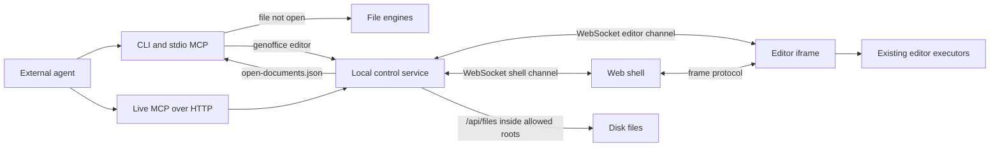

# Web architecture

Status of the browser host and the external-agent control layer.
Counts and paths below were checked at commit `8355a8f` (official
`genspark-ai/genoffice` `main` at the time this document was added) unless a
later section names a newer commit.

This file is the design of record. Update it in the same change that moves a
protocol, a tool result, a save rule, or a security boundary. Each phase
close also updates the phase table, the known gaps, and any place the landed
code differs from the plan.

## 1. Overview

The desktop Electron host stays, and its behaviour stays the same. A second
host runs the editors in a browser. An external agent drives documents through
the existing CLI and MCP. It does not talk to a model inside this product.

Non-goals:

- No model calls from the web host, the control service, or this distribution's
  default CLI (`search`, `image`, and `media` stay in the tree but are not
  registered unless `GENOFFICE_ENABLE_CLOUD=1`).
- No AI BFF and no provider credentials in the browser.
- No File System Access handles. The browser never receives a disk path it
  can write on its own; the control service is the only writer.



## 2. Decisions

| Date | Decision | Why |
| --- | --- | --- |
| 2026-09-24 | Base is official GenOffice, not a fork merge of ALI-startup/genoffice (SamuGen). | That tree was 401 commits behind and 61 ahead, had deleted Electron, renamed packages to `@samugen/*`, and added an AI BFF. Re-implement the seam; do not cherry-pick. |
| 2026-09-24 | Keep both hosts. | Desktop behaviour is unchanged. Web is a second build (`dist/web`, never `apps/*/out`). |
| 2026-09-24 | Files are read and written only by the control service, addressed by absolute path (`DocumentRef` is `{ kind: 'local', path }`). | The agent can target a path, and a background write can see that the file is open. |
| 2026-09-24 | Live tools keep the official names (`read_document`, `insert_content`, `replace_blocks`, `apply_ops`, `save_document`, `open_documents`) plus `document_status`. | External skills written for the desktop MCP keep working. Save semantics differ and are stated on the tool. |
| 2026-09-24 | `search` / `image` / `media` are off unless `GENOFFICE_ENABLE_CLOUD=1`. | This distribution does not call a model. |
| 2026-09-24 | `@genoffice/file-parse` does not depend on `@genoffice/ai-provider`. | The only mention is a comment in `packages/file-parse/src/parse.ts`. Nothing to strip. |

Upstream sync: `upstream` is `https://github.com/genspark-ai/genoffice.git`.
Fast-forward this branch onto `upstream/main` when it is a strict descendant.
Record each merge in section 9. Conflict policy: keep desktop behaviour, replay
web-only files on top.

## 3. Platform seam

`@genoffice/platform` holds the slot factory and the shared ports. No port
member is optional. A capability a host does not have is a required key typed
`X | null`, and the caller branches. The renderer never parses a path out of a
ref; the host supplies the display name.

Shared ports: `language`, `window`, `attachments`, `agentControl`. There is no
AI port on the web host. Desktop editors keep their in-app agent behind
`ai: { enabled: true } | null`.

Per app:

```
src/renderer/platform.ts
src/renderer/platform-electron.ts   only module that reads the preload global
src/renderer/platform-web.ts
src/renderer/host-electron.ts
src/renderer/host-web.ts
vite.web.config.ts                  base /app/<kind>/, outDir dist/web/app/<kind>
```

`@host` is a Vite alias resolved at build time. The Electron bundle does not
contain the web host module as its entry, and the web bundle does not contain
the preload bridge.

`@genoffice/platform-web` holds the frame protocol, the file client, the
WebSocket client, language persistence, downloads, and IndexedDB drafts.

`@genoffice/platform-electron` holds the small helpers shared by desktop
adapters. App-specific preload types stay in the app.

## 4. Control service

Package `@genoffice/control-service`, started with `genoffice serve`.

| Surface | Role |
| --- | --- |
| static `dist/web` | Shell at `/`, editors at `/app/<kind>/`, same origin |
| `GET/PUT /api/files/*` | List, stat, read, atomic write, and create a blank docx/xlsx/pptx/pdf inside the allowed roots. An empty list path returns those roots as directories. List and stat include `mtimeMs` and `sizeBytes` |
| `GET /ws` | Editor channel and shell channel |
| `POST /mcp` | JSON-RPC MCP: `initialize`, `tools/list`, `tools/call` |
| `control.json` + socket | Same discovery as the desktop shell, protocol 2 |
| `open-documents.json` | Same shape as the desktop registry, plus `source: "control-service"` |

Security:

- Binds loopback only.
- A per-run token is written to `control.json` (mode `0600` on POSIX). The
  browser receives it as an `HttpOnly`, `SameSite=Strict` cookie set by
  `GET /api/session`. CLI reads the file.
- `/api` and `/ws` require the token and a loopback `Host`. Browser requests
  must also send an `Origin` equal to `http://<host>`.
- A path is allowed only after `realpath` of the existing ancestor, and the
  resolved path must stay inside a root passed to `--root` or
  `GENOFFICE_ALLOWED_ROOTS`.

The service holds no model key and does not import `@genoffice/ai-provider`.

## 5. Live editing protocol

Editors register `{ editorId, path, family, title, revision, dirty }` and send
a `state` message whenever those change. Commands for one editor run one at a
time. The desktop shell's socket accepts the same command names and answers
`unsupported`: live editing is the control service's job, so a desktop
`control.json` cannot be mistaken for a successful edit.

| Tool | Result |
| --- | --- |
| `read_document` / `insert_content` / `replace_blocks` / `apply_ops` | `{ applied, revision, dirty: true, persisted: false }` |
| `document_status` | `{ dirty, revision, savedRevision, lastSavedAt, connected }` |
| `save_document` | `{ persisted: true, savedRevision, path }` written back to the document's own path unless `path` is set; an existing target needs `overwrite: true` |
| `open_documents` `close` | Refuses a dirty document with `unsaved_changes` unless `unsaved` is `save` or `discard` |

`apply_ops` may include `baseRevision`. A mismatch returns `revision_conflict`
and does not run.

Stable errors: `editor_disconnected`, `unsaved_changes`, `revision_conflict`,
`file_open_in_gui`, `file_not_found`, `unsupported`.

After the socket drops, the registration stays for a lease (default 15s).
During the lease, live commands return `editor_disconnected` and background
CLI writes return `file_open_in_gui`. A clean unregister with `dirty: false`
drops the registration immediately. Nothing falls through to a disk write.

`--force` does not override a `source: "control-service"` registration.
Desktop registrations keep the old `--force` behaviour.

## 6. Save and conflict rules

- The open document's memory is the source of truth. An agent edit shows up
  in the page before it is a file.
- Edit and save are different tools. `persisted` says whether bytes were written.
- A background `docs apply` / `sheet apply` / `slides apply` / `convert` /
  `create` cannot replace a file the control service has registered.
- A closed page or a dead socket is an error, not a silent disk write.

## 7. Phase status

| Phase | State | What landed |
| --- | --- | --- |
| 0 Upstream | done | `upstream` remote; fast-forward `f36446f` to `8355a8f` |
| 1 Docs web | done | Platform packages, docs seam (`docsPlatform()`), web host at `dist/web/app/docs`, control-service file API. Web bundle has no `window.desktop`, `electron`, or `ai-provider`. Docx bytes round-trip through `/api/files`. |
| 2 Live control | done | `editor-control`, `/mcp`, `genoffice editor`, lease, `--force` ignored for `source: "control-service"`. Playwright opens `/harness/editor.html`: apply changes the page and leaves the file unchanged. |
| 3 Web shell | done | `apps/shell/src/web`: same-origin iframes, frame protocol, shell WebSocket (`open` / `focus`), IndexedDB drafts, route priority in `tabs.ts` (tested). The home page follows the desktop home (recent, starred, folders, new file) and talks only to the file API. |
| 4 PDF, slides, sheets | done with gaps | PDF renderer seam plus a pdfium-wasm web page (`read_pdf`). Slides session record is in `src/domain/session.ts`; ops stay in the Electron main process. Sheets save pipeline is `src/gateway/workbook-save.ts`. The wasm reactor source is in tree; the wasm32-wasip1 link does not succeed yet (see gaps). |

## 8. Known gaps

Absent on purpose, not a silent success:

- Docs PDF export in the browser (`exportPdf` rejects; print uses `window.print`).
- Docs crash-recovery is an IndexedDB draft, not the desktop userData copy.
- Encrypted docx open, Zotero, headless export, and the in-app AI panel are
  desktop-only. The panel is not mounted when `ai` is null. `ai/tools.ts`
  stays, so an external command can still run the editor executors.
- Slides document operations still live in the Electron main process. The
  session record itself lives in `apps/slides/src/domain/session.ts`. The web
  host can register a slides editor; ops that need the main-process session
  answer `unsupported` until those functions move.
- `pptx-engine` still mentions `Buffer` and Node built-ins. The web slides
  entry does not import the engine. A browser-safety test guards the new
  `bytes.ts` helper only.
- Sheets `open` / `read_range` / `close` live in `apps/sheets/native/xlsx-engine/src/protocol.rs` and `wasm_api.rs`. On wasm32, indexing runs inline and `canonicalize` is skipped. `cargo check` of the native crate still succeeds. `cargo build --target wasm32-wasip1` fails in `zstd-sys`: the installed clang has no `wasm32-unknown-wasip1` target, so there is no reactor binary and no sidecar-parity run yet. The desktop sidecar command set stays in `main.rs`.

## 9. Upstream sync log

| Date | Range | Notes |
| --- | --- | --- |
| 2026-09-24 | `f36446f`..`8355a8f` | Fast-forward. Three upstream fixes (chart extrema, slides redo routing, macOS font test assets). No web files existed yet, so no conflicts. |
